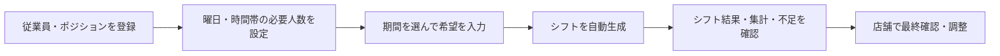
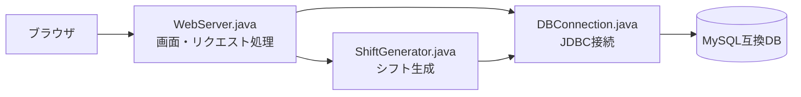

# シフト自動作成システム

**従業員の希望と店舗の配置条件をもとに、シフト作成を支援するWebアプリです。**

アルバイト先の店長へのヒアリングをもとに開発し、現在は実際の店舗で運用しています。希望の収集からシフト生成、勤務時間の集計、不足人数の確認までをブラウザ上で行えます。

| 導入前 | 導入後 |
| --- | --- |
| 営業時間後に手作業でシフトを作成 | 希望と配置条件を登録して自動生成 |
| 集計・配置・調整に約4時間 | 同じ作業全体を約30分に短縮 |

※時間は開発者が店舗での運用を通じて確認した実績です。最終的な確認・調整を含みます。

[開発背景](#開発背景) · [使い方](#使い方) · [主な機能](#主な機能) · [ローカルでの起動](#ローカルでの起動)

## 開発背景

アルバイト先では、店長が営業時間後に手作業でシフトを作成していました。従業員の希望だけでなく、時間帯ごとの必要人数、ホール・キッチンの担当、経験のバランスも考える必要があり、作成には多くの時間がかかっていました。

大学で学んだITの知識を活かしてこの負担を軽減したいと考え、開発を始めました。店長やアルバイト仲間へのヒアリングを重ね、実際の業務で使えることと、ITに苦手意識がある方でも操作しやすいことを重視しています。

## 使い方



### 1. 店舗の条件を設定する

「従業員」で雇用区分や担当ポジション、経験レベルを登録します。「必要人数」では、曜日区分・時間帯・ポジションごとの必要人数を設定します。

### 2. 希望を入力する

「希望入力」で従業員と開始日・終了日を選び、「表示」を押します。各日について「休み」「終日OK」「時間指定」を選び、最後に「提出する」を押します。入力中の合計時間も確認できます。

- 1回に表示・登録できる期間は、開始日を含めて最大62日です。
- 期間を切り替えれば、それ以降の希望も登録できます。
- 期間を変更する前に、入力中の希望を提出してください。
- 同じ従業員・同じ期間を再提出すると、その期間の希望が置き換わります。

### 3. シフトを生成する

「シフト自動生成」で対象の開始日・終了日を指定して生成します。希望入力画面で選んだ期間とは別に、生成する期間を指定してください。

**再生成すると、指定期間の作成済みシフトが削除され、新しい結果に置き換わります。**

### 4. 結果を確認する

「シフト結果」で全体の配置、「日付別」でその日の詳細を確認します。「集計」で勤務時間などを確認し、「不足」で必要人数を満たせていない時間帯を確認します。

自動生成後は、店舗で内容を確認し、必要に応じて条件の見直しや調整を行います。

## 画面紹介

| 画面 | 確認できること |
| --- | --- |
| 希望入力 | 対象期間、日ごとの勤務希望、希望時間の合計 |
| シフト結果 | 日別・時間帯別の配置 |
| 日付別 | 選択した日の勤務者や、希望を出していて配置されていない従業員 |
| 集計 | 従業員ごとの希望時間・採用時間・採用率・出勤回数 |
| 不足 | 日付・時間・ポジションごとの不足人数 |

<!-- スクリーンショットを追加したら、以下のコメントを外してください。
### 希望入力


### シフト結果


### 集計

-->

スクリーンショットの追加方法は [画像掲載ガイド](docs/images/README.md) にまとめています。

## 主な機能

| 分類 | 機能 |
| --- | --- |
| 従業員管理 | 従業員の登録・編集・削除、雇用区分の管理 |
| ポジション管理 | ポジションの登録、従業員ごとの担当・経験レベルの設定 |
| 希望管理 | 期間を指定した希望の一括登録、登録済み希望の確認 |
| 配置条件 | 曜日・時間帯・ポジションごとの必要人数の設定 |
| 自動生成 | 希望や配置条件を考慮したシフト生成 |
| 結果確認 | シフト一覧、日付別表示、勤務時間などの集計、不足人数の表示 |
| ログイン | ログイン・ログアウト、パスワード変更 |

## シフト生成で工夫したこと

従業員の希望、必要人数、担当ポジション、経験レベル、最低勤務時間、勤務時間の偏りなどを考慮しています。

当初は必要人数を満たすことを優先していましたが、一部の従業員に勤務が偏る課題がありました。そこで、店長に実際の配置で優先している条件を確認し、生成ロジックを改善しました。

現在の必要人数設定画面では「平日（月〜木）」「金曜日」「土日」の3区分を扱います。また、人数だけでなく経験レベルの組み合わせも生成ロジックで考慮しています。

希望や条件の組み合わせによっては、必要人数を満たせない場合があります。その場合も不足画面から確認できるようにしています。

## 使用技術・構成

| 用途 | 技術 |
| --- | --- |
| アプリケーション | Java 17、JDK標準のHttpServer |
| 画面 | Javaで生成するHTML、CSS、JavaScript |
| データベース接続 | JDBC、MySQL Connector/J |
| データベース | MySQL互換データベース（MySQL / TiDB向けSQLを同梱） |
| 実行・公開 | Docker、Render |
| バージョン管理 | Git / GitHub |



## ローカルでの起動

### 必要なもの

- JDK 17以上
- 接続可能なMySQL互換データベースと、アプリが使用するテーブル
- `lib/` 内のMySQL Connector/J

リポジトリには `shift_system_dump.sql` と `shift_system_tidb.sql` があります。これらはデータを含むダンプであり、空のDBを作るためだけのファイルではありません。検証には専用DBを用意し、内容を確認してから利用してください。

起動時にログイン用の `app_users` と期間設定用の `app_settings` は自動作成されます。従業員・希望・勤務シフトなどの業務テーブルは事前に用意する必要があります。

### 環境変数

| 変数 | 内容 | 省略時 |
| --- | --- | --- |
| `DB_URL` | JDBC接続URL | `jdbc:mysql://localhost:3306/shift_system` |
| `DB_USER` | DBユーザー名 | `root` |
| `DB_PASSWORD` | DBパスワード | 必須 |
| `APP_USERNAME_1` / `APP_USERNAME_2` | 2つのログイン名（別々の名前を指定） | 両方必須 |
| `APP_PASSWORD_1` / `APP_PASSWORD_2` | 各ログインの初期パスワード（8文字以上） | 両方必須 |
| `PORT` | HTTP待受ポート | `8080`（Dockerでは`10000`） |

ログイン情報は初回登録時にDBへ保存されます。登録済みユーザーのパスワードは環境変数を変えても上書きされません。変更には画面の「パスワード変更」を使います。

### Windows / PowerShell

プロジェクトのルートで、接続先とパスワードを実際の値に置き換えて実行します。

```powershell
$env:DB_URL = "jdbc:mysql://localhost:3306/shift_system"
$env:DB_USER = "root"
$env:DB_PASSWORD = "<DBのパスワード>"
$env:APP_USERNAME_1 = "manager"
$env:APP_PASSWORD_1 = "<8文字以上のパスワード1>"
$env:APP_USERNAME_2 = "staff"
$env:APP_PASSWORD_2 = "<8文字以上のパスワード2>"

javac -encoding UTF-8 -cp "lib/*" -d bin src/*.java
java -cp "bin;lib/*" WebServer
```

起動後に `http://localhost:8080` を開きます。停止するときは起動したターミナルで `Ctrl+C` を押します。

### Docker

必要な環境変数を設定した `--env-file` 用ファイルを用意して実行します。

```shell
docker build -t shift-system .
docker run --rm -p 10000:10000 --env-file .env shift-system
```

`http://localhost:10000` でアクセスできます。DB接続先には、コンテナから到達できるホストを指定します。パスワードを含む `.env` はGitに登録しないでください。

## 主なファイル

```text
src/
  WebServer.java       Web画面・ログイン・各種登録処理
  ShiftGenerator.java シフトの自動生成
  DBConnection.java   環境変数を使ったDB接続
  Main.java           コンソール版の操作メニュー
lib/                  JDBCドライバー
Dockerfile            ビルド・公開用のコンテナ設定
docs/images/          README掲載用の画面画像
```

## 今後の改善

- 利用者からのフィードバックに基づく操作画面の改善
- 勤務時間の偏りや配置条件を考慮した生成ロジックの改善
- 検証用データ・DB初期構築手順の整備
