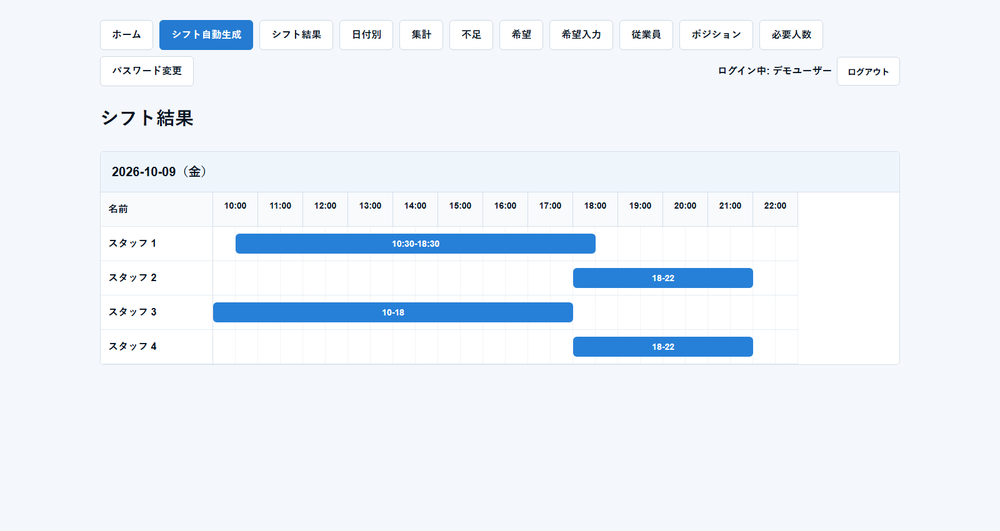
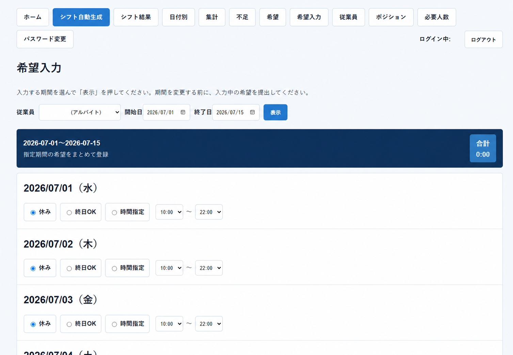
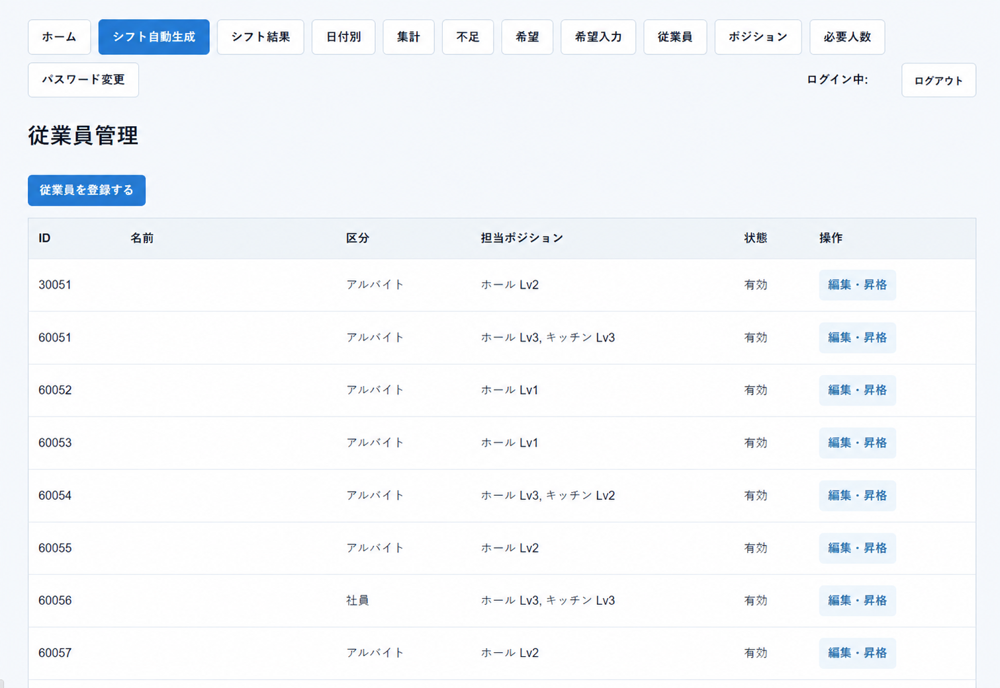
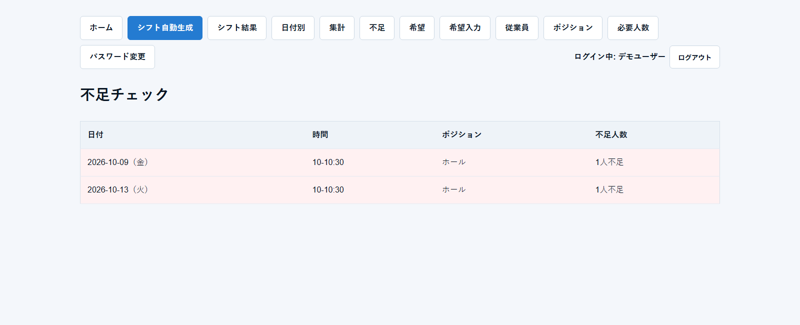

# シフト自動作成システム

**従業員の勤務希望と店舗の配置条件から、シフト案を作成するWebアプリです。**

アルバイト先の店長へのヒアリングをもとに開発し、現在は実際の店舗で運用しています。希望の収集からシフト生成、勤務時間の集計、不足人数の確認までをブラウザ上で行えます。

| 導入前 | 導入後 |
| --- | --- |
| 営業時間後に手作業でシフトを作成 | 希望と配置条件を登録して自動生成 |
| 集計・配置・調整に約4時間 | 同じ作業全体を約30分に短縮 |

※時間は開発者が店舗での運用を通じて確認した実績です。最終的な確認・調整を含みます。

勤務時間を横棒で表示し、出勤・退勤・交代のタイミングを確認できます。

## 開発背景

アルバイト先では、店長が営業時間後に手作業でシフトを作成していました。従業員の希望だけでなく、時間帯ごとの必要人数、ホール・キッチンの担当、経験のバランスも考える必要があり、作成には多くの時間がかかっていました。

大学で学んだITの知識を使い、この負担を減らしたいと考えて開発を始めました。店長やアルバイト仲間に話を聞き、どのような基準で人を配置しているのかを確認しながら、機能と条件を形にしています。

重視しているのは、実際の店舗で使い続けられることです。希望を入力する手間や、生成結果の分かりにくさも改善の対象とし、運用中に気づいた問題を一つずつ見直しています。

## 使い方

従業員と配置条件を登録し、勤務希望を入力してからシフトを生成します。生成した結果と不足人数を確認し、店舗で最終的な調整を行います。

### 1. 店舗の条件を設定する

「従業員」で雇用区分や担当ポジション、経験レベルを登録します。「必要人数」では、曜日区分・時間帯・ポジションごとの必要人数を設定します。

### 2. 希望を入力する

「希望入力」で従業員と開始日・終了日を選び、「表示」を押します。各日について「休み」「終日OK」「時間指定」を選び、最後に「提出する」を押します。入力中の合計時間も確認できます。

1回に入力できる期間は最大62日です。「今月」「来月」で期間を切り替え、全日・曜日単位でまとめて入力できます。提出後も同じ従業員・期間の画面に戻るため、内容を続けて確認できます。

入力内容は「提出する」を押すまで保存されません。期間を変更する前に提出してください。同じ従業員・同じ期間を再提出すると、その期間の希望が置き換わります。

### 3. シフトを生成する

「シフト自動生成」で対象の開始日・終了日を指定して生成します。希望入力画面で選んだ期間とは別に、生成する期間を指定してください。生成はバックグラウンドで進み、進捗率・処理済みの日数・エラーを画面に表示します。ページを閉じても処理は続き、生成画面に戻ると進捗を再確認できます。

**再生成すると、指定期間の作成済みシフトが削除され、新しい結果に置き換わります。**

### 4. 結果を確認する

「シフト結果」で全体の配置、「日付別」でその日の詳細を確認します。「集計」で勤務時間などを確認し、「不足」で必要人数を満たせていない時間帯を確認します。

自動生成後は、店舗で内容を確認し、必要に応じて条件の見直しや調整を行います。

## 画面紹介

| 画面 | 確認できること |
| --- | --- |
| 希望入力 | 対象期間、日ごとの勤務希望、希望時間の合計 |
| シフト結果 | 日別・時間帯別の配置 |
| 日付別 | 選択した日の勤務者や、希望を出していて配置されていない従業員 |
| 集計 | 従業員ごとの希望時間・採用時間・採用率・出勤回数 |
| 不足 | 日付・時間・ポジションごとの不足人数 |

### 希望入力

開始日・終了日を指定し、日ごとに「休み」「終日OK」「時間指定」を選んで希望を提出できます。希望時間の合計も画面上で確認できます。

### 従業員管理

従業員の雇用区分、担当ポジションとレベル、在籍状態を一覧で確認できます。「編集・昇格」から登録内容を変更できます。

### シフト結果

冒頭のシフト結果画面では、日別の勤務時間を横棒で表示しています。掲載例では18時から2人を配置し、18時半の退勤後も2人で勤務する形になっています。

生成時はキッチンを先に配置し、残った不足には連続勤務を追加して補正します。たとえば18時半から不足する場合、希望や担当条件を満たす人の勤務を18〜22時で確保し、原則4時間の勤務を保ちます。自動生成後の最終確認は店舗で行います。

### 不足チェック

日付・時間帯・ポジション別に不足人数を表示します。希望者が足りない時間帯は不足として残し、追加募集や店舗での調整が必要な箇所を確認できます。

※掲載画像は、従業員の氏名とログイン名を非表示または仮名に加工しています。追加画像は本番画面のHTMLを匿名化してブラウザで撮影したもので、勤務時間や不足人数は変更していません。シフト結果は2026年10月9日の部分を掲載しています。

スクリーンショットの追加方法は [画像掲載ガイド](docs/images/README.md) にまとめています。

## シフト生成で工夫したこと

### キッチンを先に配置する

ホール専任の人がいる一方で、両方を担当できる人までホールに配置され、キッチンに不足が残るケースがありました。

そこで、キッチンの必要人数から先に配置するよう変更しました。候補者の勤務継続や勤務実績などが同条件なら、担当可能なポジションが少ない人を優先します。最後に、必要人数を超えているポジションから不足しているポジションへ担当を調整します。

### 退勤後の不足を、まとまった勤務で補う

30分ごとに人数をそろえるだけでは、交代後の不足を埋められないことがありました。たとえば18時には2人いても、1人が18時半に退勤すると残りは1人になります。その時点で新しく配置しようとしても、閉店まで3.5時間しかなく、原則4時間の勤務を確保できません。

このため、生成後に1日分の不足を確認し、必要なら開始時刻を戻して連続勤務を追加する補正を実装しました。

| 改善前 | 改善後 |
| --- | --- |
| 18時半に不足が発生してから候補者を探す | 18時半の不足に対し、18〜22時の勤務を追加できる |
| 社員が18時に退勤し、夜の不足が残る | 条件を満たすアルバイトを優先し、代替がなければ社員の勤務を連続延長する |

掲載例では18〜22時の勤務が追加され、18時半以降も2人の配置になっています。希望・休み・担当資格を守りながら補正し、希望者がいない時間帯は不足として残します。

### 新人の勤務を3時間のまとまりで確保する

新人は1日1回、連続3時間をまとめて配置し、21時までに終了します。希望が3時間未満の場合や、3時間の途中に休みがある場合は配置しません。後の不足補正でも新人の勤務を延長しません。

### 人数と経験のバランスを考慮する

必要人数の設定画面は「平日（月〜木）」「金曜日」「土日」の3区分です。人数に加えて社員の有無や経験レベルの合計も確認し、経験レベルの判定には土曜と日曜で異なる条件もあります。

候補者は勤務の継続性を優先し、その後に勤務目標、対象期間の出勤日数・勤務時間などを比較します。勤務時間の均等化や、すべての不足の解消を保証するものではありません。自動生成後は、店舗で最終確認・調整を行います。

## 使用技術と構成

サーバー側はJava 17で実装し、JDK標準のHTTPサーバーを使用しています。画面はHTML・CSS・JavaScriptで構成し、勤務希望やシフトはMySQL互換のデータベースに保存しています。データベースへの接続にはJDBCを使用しています。

アプリはDockerで実行環境をまとめ、Renderで公開しています。ソースコードはGitとGitHubで管理しています。

画面や登録を扱う処理、シフトを生成する処理、進捗を管理する処理を分けています。さらに、担当変更で不足を補う処理と、勤務時間を追加して不足を補う処理を分け、条件ごとに動作を確認しやすくしています。

## 動作確認

期間入力、新人の配置、勤務の重なり、生成中のエラー、担当変更、退勤後の不足補正などについて、架空データを使った89項目のテストを確認しています。

特に今回の不足補正では、18時半の不足に対して18〜22時の勤務を追加できること、代替者がいない場合に社員の勤務を継続できること、休みや担当資格を無視して配置しないことを確認しました。実際の店舗でも、生成結果と希望・不足画面を照合して動作を確認しています。

自動テストは実際のデータベースを使う生成処理全体を検証するものではないため、今後は検証用データベースを使った確認も充実させる予定です。

## 現在の課題と今後の改善

今後は、店舗側で変更できる配置条件を増やし、売上や営業状況の変化に合わせやすくしたいと考えています。現在は経験レベルなど一部の条件がプログラム内にあり、祝日の判定にも対応していません。

勤務時間については、月間目標と生成対象期間の扱いを整理する必要があります。現状には、目標時間と30分単位の勤務枠数を直接比較している箇所があるため、単位と集計期間をそろえる改善を予定しています。集計画面にも期間指定を追加し、同じ期間の希望と勤務を比較できるようにします。

また、連勤上限、休日の自動確保、休憩の挿入、週の勤務時間上限は未実装です。現時点では店舗での最終確認を前提とし、実際の運用ルールを確認しながら対応範囲を広げていきます。

生成は現在、1台のサーバー内で進捗と重複実行を管理しています。サーバー再起動時の状態保持や、生成途中で失敗した場合の復旧も今後の改善点です。失敗時には一部のシフトが残る場合があるため、原因を確認してから再生成する運用にしています。

## 開発・検証を行う方へ

起動にはJDK 17以上と、必要なテーブルを用意したMySQL互換データベースが必要です。環境変数の設定、起動方法、テストの実行手順は、[開発・検証ガイド](docs/development.md)にまとめています。
